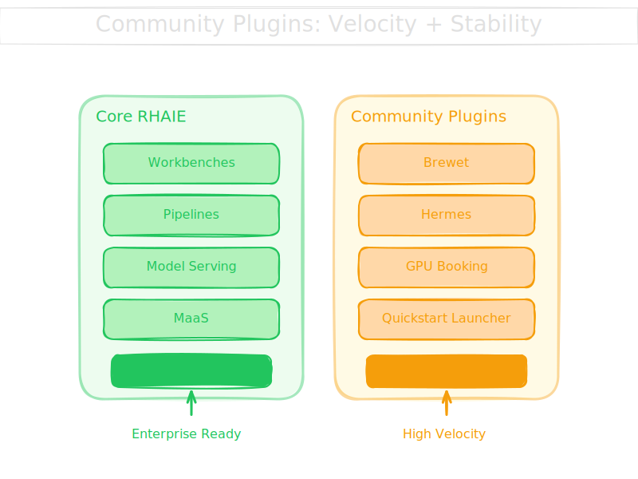

# Red Hat AI Community Plugins Charter

## Why This Exists

AI moves fast. Enterprise platforms need stability. These forces create tension.

Red Hat AI Enterprise (RHAIE) solves this by separating concerns:

- **Core product**: Stable AI platform primitives with support SLAs. Workbenches, pipelines, model serving, MaaS, and so on. The foundation Red Hat supports, tests, document and maintains.
- **Community plugins**: Everything else. Integrations, experiments, utilities, prototypes. High velocity, short-lived when needed, no support burden on the core.

Community Plugins let us deliver the speed AI demands while protecting the stability enterprises require. They extend RHAIE without destabilizing it.

## Principles

**Velocity over perfection.** Plugins can be experimental, exploratory, even temporary. If something stops being useful, it can be deprecated cleanly.

**Community-driven.** Anyone can contribute a plugin: Red Hat engineers, partners, individuals. The barrier to entry is low. Quality comes from transparency and user choice.

**Clean separation.** Plugins are clearly marked in the dashboard. Users know what's supported and what isn't. Admins can enable/disable plugins without touching core functionality.

**Safe to remove.** Plugins must be completely removable without affecting RHAIE core. No database migrations, no leftover state, no dependencies that break core features.

**Namespace isolation.** Plugins run with minimal permissions and cannot access other users' data or compromise cluster security.

## What Is a Community Plugin?

A community plugin is a dashboard extension with a visible UI presence in RHAIE. Every plugin must render something in the dashboard — backend-only services without a UI are out of scope.

A community plugin:

1. **Integrates cleanly** - Appears in the RHAIE dashboard with a clear "Community Plugin" tag. The exact dashboard integration mechanism is TBD and will be defined with the RHAIE dashboard team.
2. **Respects RBAC** - Admins can control which users/groups see which plugins
3. **Deploys via Helm** - Standard installation, upgrade, and removal
4. **Declares its scope** - Per-project, cluster-shared, or both. A single plugin can support both deployment models, letting admins and users choose what fits their needs.
5. **Is self-contained** - Can be completely removed without affecting core RHAIE

### Examples of Community Plugins candidates

- **Brewet** (formerly ODH TEC): Technical enablement catalog and demos
- **Sardeenz**: Specialized visualization tools
- **Hermes**: A way to deploy and configure an instance of Hermes Agent on OpenShift
- **GPU Booking App**: Resource scheduling and calendar
- **OpenShift Skills**: AI-powered cluster operations
- **Quickstart Launcher**: One-click deployment of quickstart templates

## What Is NOT a Community Plugin

Plugins **cannot**:

- Replace or override core RHAIE features
- Require cluster-admin privileges to use (installation is different - admins install, users use)
- Access RHAIE's internal databases or APIs directly
- Modify other users' projects or data
- Run privileged containers or bypass security policies
- Create dependencies that would break core features if the plugin is removed

If it needs to be in core to work, it's not a community plugin.

## Plugin Lifecycle

Plugins progress through these states:

### Experimental
New plugins start here. Expect breaking changes, incomplete features, possible deprecation. Use at your own risk.

### Beta
Stabilizing. API may still change, but maintainers commit to migration paths. Suitable for non-critical workloads.

### Stable-Candidate
Mature and reliable. Maintainers commit to backward compatibility and deprecation notices. Suitable for critical workloads if you accept the community support model. Adoption into RHAIE core is possible but rare — this status primarily signals maturity, not a pipeline to product inclusion.

### Deprecated
No longer recommended. Security fixes only. Maintainers must give 90 days notice before moving to archived.

### Archived
No longer maintained. Remains in catalog for historical reference but is not installable. No support, no updates.

## Support Model

**Community plugins are unsupported by Red Hat.**

- Users file issues in the plugin's GitHub repository
- Plugin maintainers decide response times and fix priorities
- Red Hat may track adoption metrics internally but provides no SLAs
- Plugins must declare which RHOAI versions they support via `rhoai_compatibility` in their `plugin.yaml`. Plugins may break with RHOAI upgrades; maintainers are responsible for testing and updating compatibility declarations
- Use community forums, Slack channels, or plugin-specific support channels

If you need Red Hat support, use core RHAIE features only.

## Governance

### Adding a Plugin

Anyone can submit a plugin to the catalog:

1. Create a plugin repository with required structure (see technical requirements)
2. Open a PR adding your plugin to `plugins.yaml`
3. Automated CI validates schema, checks links, runs security scans
4. Red Hat team reviews for policy compliance (not technical quality)
5. Approved PRs merge and appear in the catalog

First-come, first-served. Later plugins with similar functionality must differentiate clearly.

### Removing a Plugin

Maintainers can archive their plugin anytime. Red Hat can remove plugins that:

- Violate security policies
- Impersonate core features
- Are abandoned (maintainer stops responding to issues and PRs for 6+ months)
- Create legal or compliance issues

Removed plugins get 90-day deprecation notice unless they pose immediate security risk.

### Conflict Resolution

If two plugins provide overlapping functionality:
- Both can coexist if clearly differentiated
- Users and admins choose which to use
- Red Hat does not pick winners; market adoption decides

If technical conflicts arise (port collisions, resource names, etc.), later plugin must adapt.

## Adoption Into Core

In rare cases, Red Hat may adopt a community plugin into the core product. This is not the expected path — most plugins will remain community-maintained indefinitely. The lifecycle states signal maturity, not a queue for product inclusion.

Adoption, when it happens, requires:

- Maintainer agreement
- Code/license review and transfer
- Red Hat QE validation
- Full support commitment from Red Hat engineering

Plugins don't disappear from the community catalog when adopted; they remain available while the core integration is built.

Internally, Red Hat tracks plugin adoption metrics to inform these decisions.

## Technical Requirements

All plugins must:

1. **Have a `plugin.yaml` manifest** - Declares metadata, dashboard integration, deployment model
2. **Deploy via Helm chart** - Standard installation method, no custom scripts or Makefiles
3. **Follow OpenShift best practices** - Non-root containers (UID 1001+), UBI9 base images preferred
4. **Include documentation** - README with screenshots, installation guide, RHAIE version compatibility
5. **Declare RHOAI version compatibility** - Which versions the plugin has been tested against (see [`rhoai_compatibility`](docs/plugin-spec.md#required-fields) in the plugin spec). Plugins with no declared compatibility will not be accepted.
6. **Declare RBAC requirements** - What permissions the plugin needs
7. **Support clean removal** - Uninstalling the Helm release removes all resources

See [Plugin Specification](docs/plugin-spec.md) for detailed technical requirements.

## Forward Compatibility

At this stage, plugins declare which RHOAI versions they have been tested against. Authors are responsible for testing against new RHOAI releases and updating their `rhoai_compatibility.tested_versions` field.

As the ecosystem matures, Red Hat may provide RC access, breaking change notices, and CI test templates — but those are future goals, not current commitments.

## Vision: In-Product Plugin Catalog

The long-term goal is an in-product catalog where RHAIE users can discover, browse, and install community plugins directly from the dashboard — similar to an app marketplace. Admins would manage available plugins; users would provision per-project instances with a click.

The initial implementation will rely on the `plugins.yaml` registry in this repo and manual Helm-based installation. The in-product catalog is a future milestone that depends on dashboard integration work with the RHAIE team.

## Getting Started

- **For plugin users**: Browse the catalog, talk to your admin about enabling plugins
- **For admins**: See installation guides in each plugin's repository
- **For plugin authors**: Read [CONTRIBUTING.md](CONTRIBUTING.md) to submit your plugin

Questions? Open an issue in this repository or join the community discussion.

---

*This is a living document. Propose changes via pull request.*
