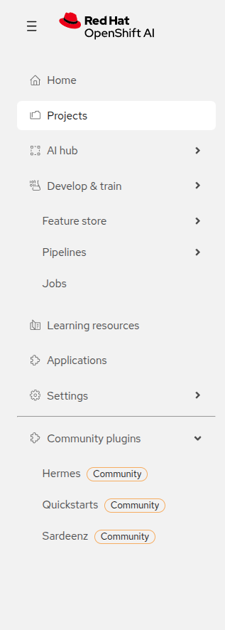
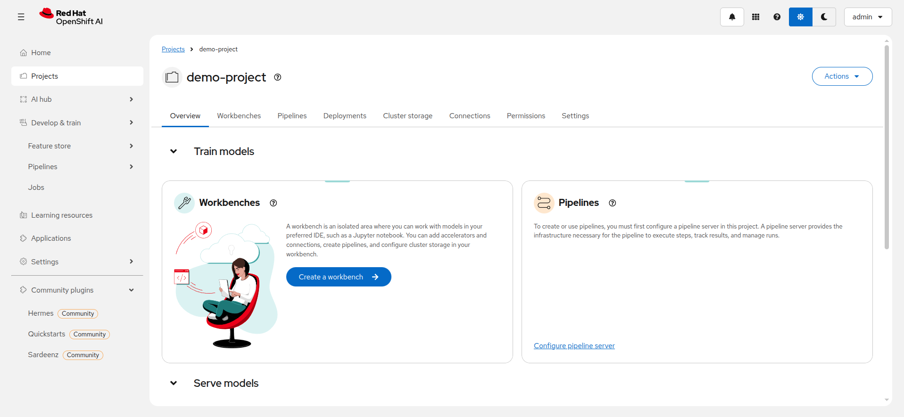

# Red Hat AI Community Plugins Charter

Welcome to the Red Hat AI Community Plugins initiative.

## What is this?

This repository contains the charter, guidelines, and catalog for community plugins that extend Red Hat AI Enterprise (RHAIE).

Community plugins enable high-velocity experimentation and innovation while keeping the core RHAIE platform stable and supported.

## Screenshots

Community plugins appear in the RHAIE dashboard sidebar, clearly tagged to distinguish them from core features.

## Documentation

- **[Charter](CHARTER.md)** - Read the full charter to understand the philosophy, principles, and governance of community plugins
- **[Contributing](CONTRIBUTING.md)** - How to submit your plugin to the catalog
- **[Plugin Specification](docs/plugin-spec.md)** - Technical requirements for building a plugin
- **[Helm Requirements](docs/helm-requirements.md)** - Helm chart guidelines
- **[Security Guidelines](docs/security-guidelines.md)** - Container and RBAC security rules

## Quick Links

- [Plugin Catalog](plugins.yaml)
- [Example plugin.yaml](docs/examples/example-plugin.yaml)
- [Container Registry](https://quay.io/organization/rh-ai-community-plugins)

## Getting Started

- **For plugin users**: Browse the catalog and talk to your RHAIE admin about enabling plugins
- **For admins**: See installation guides in each plugin's repository
- **For plugin authors**: Read the [Charter](CHARTER.md) and [Contributing Guide](CONTRIBUTING.md)

---
